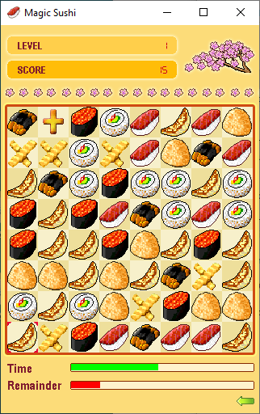

Magic-Sushi
===========



A port of simple puzzle game from MTK OS to SDL1, SDL2 and Emscripten.

## Controls

* Arrows and 4, 6, 8, 2 on Keypad – Move cursor.
* Mouse click, Space, Return and 5 on Keypad – Select tile.
* M and 7 on Keypad – Mute sound.

## Web Demo

* [Magic Sushi](https://lab.exlmoto.ru/sushi/) page.

## Download

Ready-to-run game builds are available in the "[Releases](https://github.com/EXL/Magic-Sushi/releases)" section.

## Run Tips

Linux: Install the SDL{1,2}, SDL{1,2}_image, and SDL{1,2}_mixer libraries before starting the game.

```sh
$ sudo apt install libsdl1.2debian libsdl-mixer1.2 libsdl-image1.2
$ sudo apt install libsdl2-2.0-0 libsdl2-mixer-2.0-0 libsdl2-image-2.0-0
$ ./Magic-Sushi-SDL1
$ ./Magic-Sushi-SDL2
```

Web: Add a MIME type for WASM to serve files properly.\
More information about this here: [Hosting a WebAssembly App](https://platform.uno/docs/articles/how-to-host-a-webassembly-app.html).

Nginx: Add this to the `http` section of the configuration file:

```nginx
types {
    application/wasm wasm;
}
```

Apache: Add this to the `apache2.conf` or `httpd.conf` configuration files:

```apache
AddType application/wasm .wasm
```

## Build for Windows

Install [MSYS2](https://www.msys2.org/) first and run "MSYS2 MINGW64" shell.

```sh
$ pacman -S mingw-w64-x86_64-make mingw-w64-x86_64-gcc
$ pacman -S mingw-w64-x86_64-SDL2 mingw-w64-x86_64-SDL2_mixer mingw-w64-x86_64-SDL2_image
$ mingw32-make build-sdl1-windows
$ mingw32-make build-sdl1-windows-static # Alternative, maybe broken over time.
$ mingw32-make build-sdl2-windows
$ mingw32-make build-sdl2-windows-static # Alternative, maybe broken over time.
```

## Build for Linux

```sh
$ sudo apt install build-essential
$ sudo apt install libsdl2-dev libsdl2-mixer-dev libsdl2-image-dev
$ sudo apt install libsdl1.2-dev libsdl-mixer1.2-dev libsdl-image1.2-dev
$ make build-sdl1-linux
$ make build-sdl2-linux
```

## Build for Web

Install [Emscripten](https://emscripten.org/docs/getting_started/downloads.html) first.

```sh
$ source /opt/emsdk/emsdk_env.sh
$ make build-sdl1-web
$ make build-sdl2-web
```

## Build for EZX

Install [Motorola EZX SDK](TODO: Link) first.

```sh
$ source /opt/toolchains/motoezx/setenv-a1200.sh
$ make build-sdl1-ezx
```

## Other Information

Thanks to [@nehochupechatat](https://github.com/nehochupechatat) for source and [@OldPhonePreservation](https://twitter.com/oldphonepreserv) for original MTK MIDIs.
